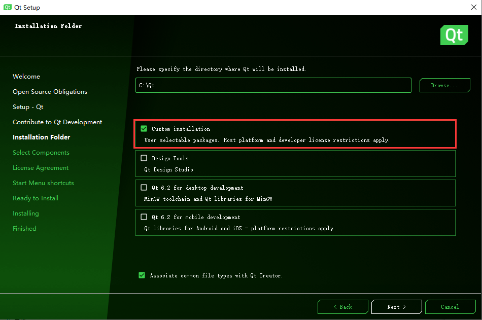
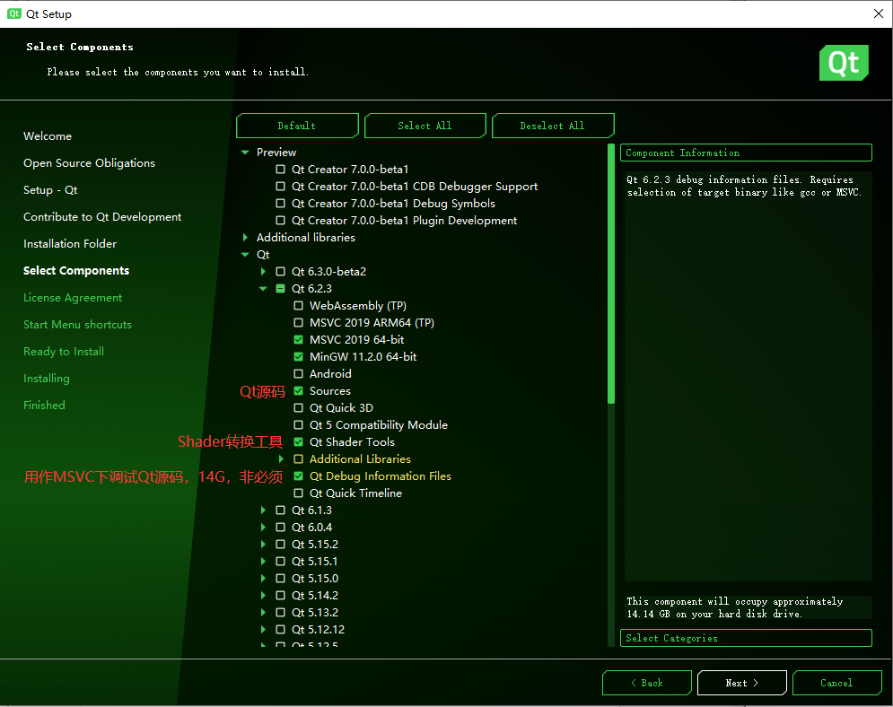
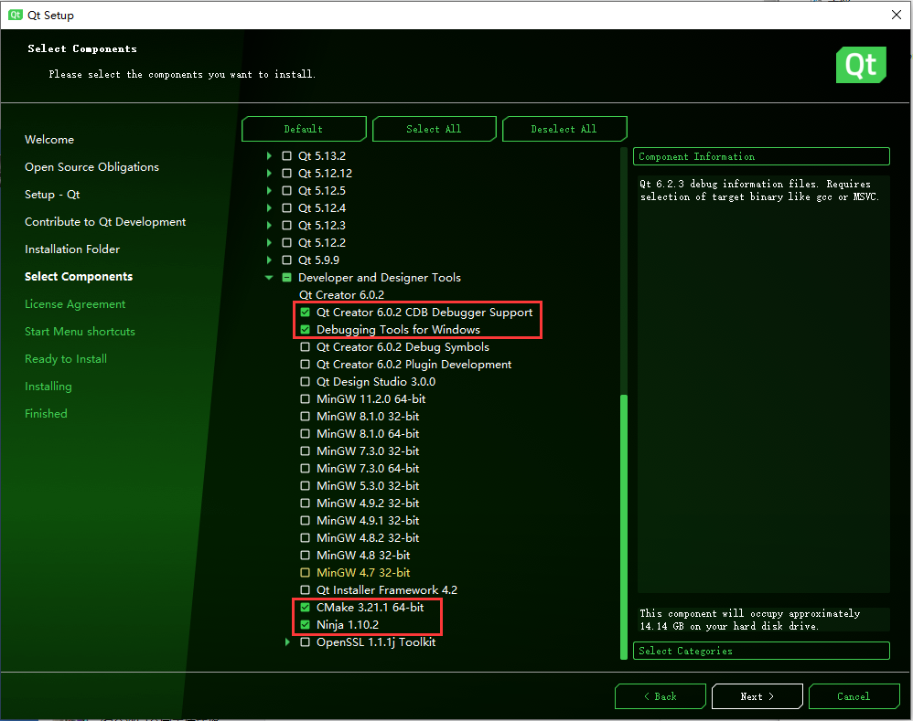
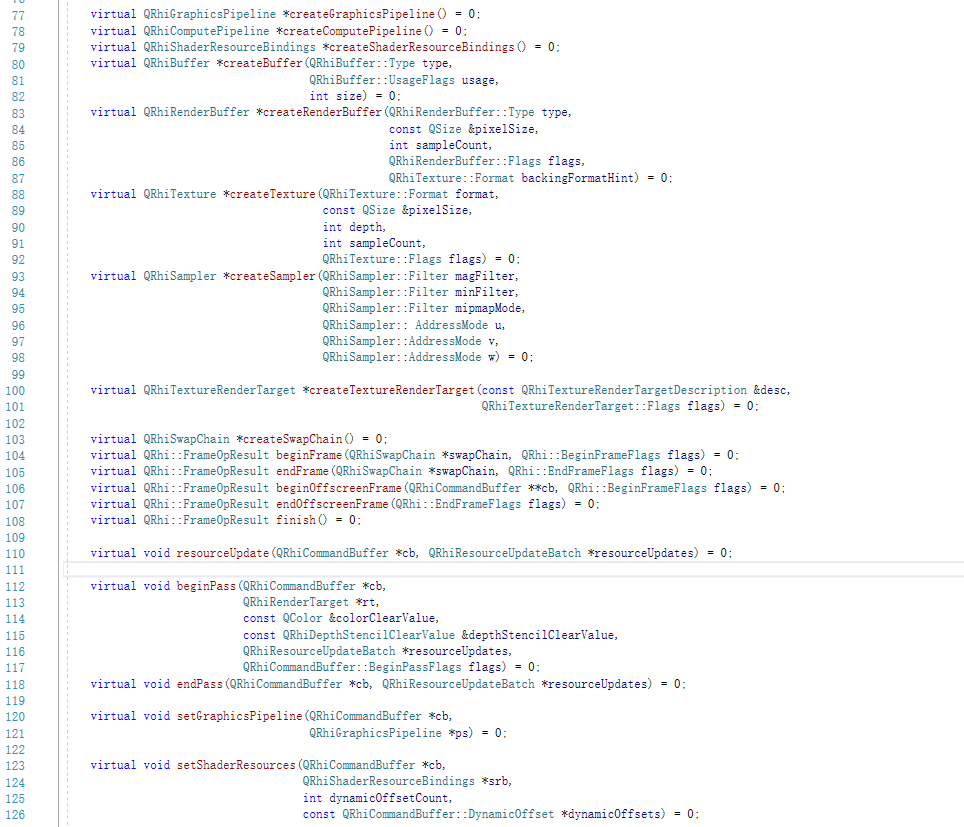
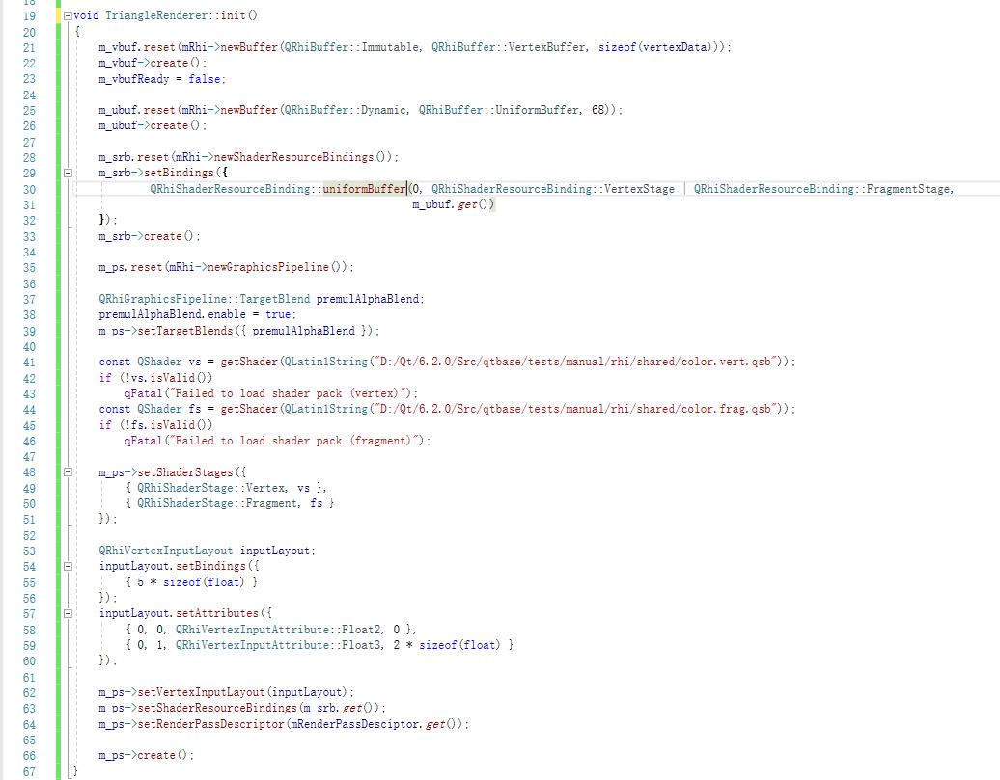
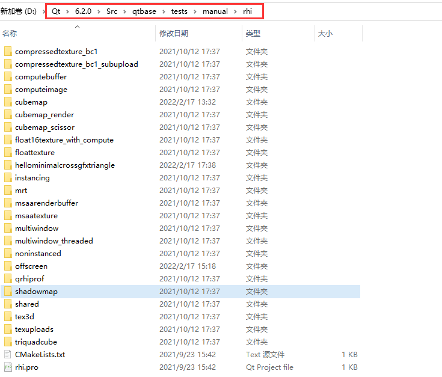
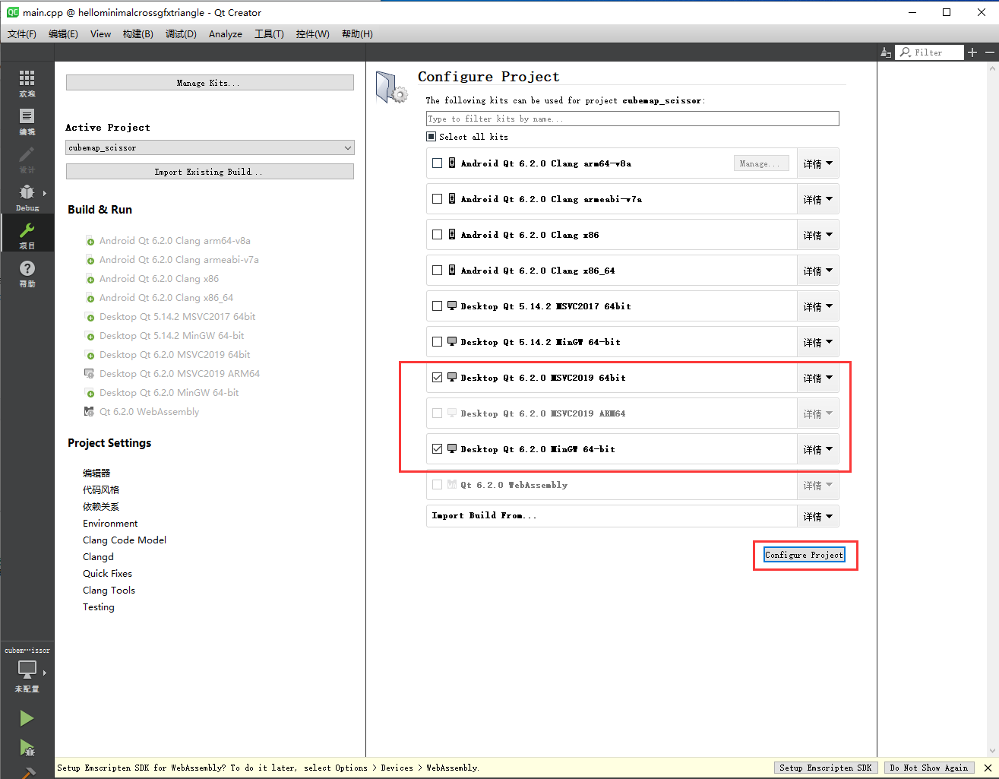

# Qt-RHI

​	Qt 6 的主要目标之一是在 Qt 的大多数地方摆脱直接使用 OpenGL，并且通过适当的抽象，允许在更广泛的图形上进行操作API，例如[Vulkan](https://www.khronos.org/vulkan/)、[Metal](https://developer.apple.com/metal/)和[Direct3D](https://docs.microsoft.com/en-us/windows/win32/direct3d)。[OpenGL](https://www.khronos.org/opengl/)（和[OpenGL ES](https://www.khronos.org/opengles/)）。这背后的主要动机不是获得性能，而是在 OpenGL 不可用或不再需要的平台和设备上，仍能确保**Qt无处不在**，将来也会如此。同时，能够在现代的、较低级别的、显式 API 上进行构建也可以在提高性能（例如，由于 API 开销较少而降低 CPU 使用率）和在[Qt Quick](https://doc.qt.io/qt-5/qtquick-index.html#)和其他模块背后的渲染引擎。


## 获取Qt 

- 官方在线下载器：https://download.qt.io/archive/online_installers/

- 选择最新的目录（当前为4.2），下载 [qt-unified-windows-x86-4.2.0-online.exe](https://download.qt.io/archive/online_installers/4.2/qt-unified-windows-x86-4.2.0-online.exe)

- 安装需要使用Qt账户（自行注册），然后在下面的界面选择自定义安装

- 

- 选择以下组件

  

  


## QRHI

QRHI本身并没有公开给开发者使用的，也没有文档，要想使用它，需要包含QtGui的私有模块。我是在无意中发现了它，推荐的主要原因是：

- 代码质量较高（至少比bgfx高）

- 采用了现代图形API的架构（CommandBuffer、描述符）

- 图形资源封装（Texture，Pipiline，Uniform（含对齐），Layout，RenderTarget...）

- 代码由Qt官方维护，有非常多的项目底层都在使用该代码。

- ShaderTool：QRhi使用Vulkan风格的GLSL作为shader语言，通过ShaderTool将之转换到对应厚后端的shader，（没有像bgfx那样自己乱改一通，为了适配自己的流水线结构，又加了一层转换，GLSL不像GLSL，HLSL不像HLSL）。


其中RHI的部分接口定义如下：



QRhi对很多图形资源都进行了封装，使用非常简洁，拿初始化渲染资源为例，操作如下：



## 样例解读

> 样例位于： ${Qt安装路径}\6.2.0\Src\qtbase\tests\manual\rhi



- 打开任意子文件夹，双击*.pro打开Qt项目，选择编译器（MSVC），点击config

  

- 然后点击界面左下角的绿色三角形运行程序（有虫子的是调试模式）

> *.pro 是Qt的工程文件，Qt拥有自己的构建系统（qmake），但在Qt6.0 之后开始大量使用Cmake，虽然上面的样例中拥有CMakeLists.txt，但要使用它们必须从顶级CMakeLists.txt构建整个Qt工程。

## 源码解读

> 源码位于：${Qt安装路径}\6.2.0\Src\qtbase\src\gui\rhi

- **qrhi_p.h**：该文件下可以看到Qt对RHI资源都进行了封装：

  - **QRhiViewport**、**QRhiScissor**：视口

  - **QRhiVertexInputBinding**、**QRhiVertexInputAttribute**、**QRhiVertexInputLayout**：顶点封装

  - **QRhiShaderStage**、**QRhiShaderResourceBinding**

  - **QRhiColorAttachment**

  - **QRhiResource**：所有图形资源的基类，提供destroy方法

    - **QRhiBuffer**
    - **QRhiTexture**
    - **QRhiSampler**
    - **QRhiRenderBuffer**：FrameBuffer
    - **QRhiRenderTarget**
      - **QRhiTextureRenderTarget**：用于Texture的离屏渲染
    - **QRhiRenderPassDescriptor**：Qt像vulkan1.3中的那样，删除了RenderPass结构，CmdBuffer直接使用`QRhiCommandBuffer::beginPass(rendertarget,clearcolor)`
    - **QRhiGraphicsPipeline**：图形管线
    - **QRhiComputePipeline**：计算管线
    - **QRhiCommandBuffer**：命令缓存
    - **QRhiSwapChain**：交换链

  - **QRhiResourceUpdateBatch**：提供运行时对内存的处理操作，比如：读写Buffer，上传及copy纹理。

  - **QRhiTextureSubresourceUploadDescription**、**QRhiTextureUploadDescription**、**QRhiTextureCopyDescription**、**QRhiReadbackDescription**、**QRhiTextureRenderTargetDescription**：操作描述

  - **QRhi**：通过调用静态方法`QRhi:::create(...)`来创建RHI。

    

- **qrhi_p_p.h**：**QRhi**负责提供接口给开发者，真正兼容各类图形后端是依靠**QRhiImplementation**实现的，**QRhiImplementation**提供一系列的纯虚函数，交由各个图形后端来继承实现，以`qrhimetal_p_p.h`文件为例，下拥有metal的后端**QRhiMetal**及各类图形资源的实现。

## Shader 管理

Qt中使用Vulkan风格的GLSL作为着色器语言，通过自己的着色器编译工具生成***.qsb**文件供QRhi使用，其中主要处理步骤如下：


详情请看：https://doc.qt.io/qt-6/qtshadertools-index.html

### shader静态编译

Qt提供了自己的shader转换命令行工具——**qsb.exe**（位于${Qt安装路径}\6.2.0\msvc2019_64\bin\qsb.exe）

官方说明文档：https://doc.qt.io/qt-6/qtshadertools-qsb.html

并在CMake中配备了相应的功能函数：

```C++
qt_add_shaders(ProjectTarget "res_gl3shaders"		//输出的目标文件
    GLSL "300es,330"  //设置转换目标，关键字可以是GLSL、HLSL、MSL...
    PREFIX
        "/shaders"	  //路径前缀
    FILES
       shaders/ssao.vert
       shaders/ssao.frag
       shaders/skybox.vert
       shaders/skybox.frag
)
```

### shader运行时编译

运行时编译要用到Qt的**ShaderTools**模块，在CMake连接该模块

```cmake
find_package(Qt${QT_VERSION_MAJOR} COMPONENTS ShaderTools REQUIRED)
target_link_libraries(QRhiTest PRIVATE Qt${QT_VERSION_MAJOR}::ShaderToolsPrivate)
```

```c++
#include "private\qshaderbaker_p.h"
```

```c++
QShaderBaker baker;
baker.setGeneratedShaderVariants({ QRhiShaderKey::StandardShader });
QVector<QShaderBaker::GeneratedShader> targets;		//编译到不同的shader
targets.append({ QRhiShaderKey::SpirvShader, QRhiShaderVersion(100) });
targets.append({ QRhiShaderKey::GlslShader, QRhiShaderVersion(100, QRhiShaderVersion::GlslEs) });
targets.append({ QRhiShaderKey::SpirvShader, QRhiShaderVersion(120) });
targets.append({ QRhiShaderKey::HlslShader, QRhiShaderVersion(50) });
targets.append({ QRhiShaderKey::MslShader, QRhiShaderVersion(12) });
baker.setGeneratedShaders(targets);
QShader shaders = baker.bake();
if (!shaders.isValid())
    qWarning() << baker.errorMessage();
```

## Cmake构建

QRhi是Qt的私有模块，使用它需要包含Qt的`GUIPrivate`模块，其中CMake操作如下

```cmake
find_package(Qt${QT_VERSION_MAJOR} COMPONENTS GUIPrivate REQUIRED)
target_link_libraries(QRhiTest PRIVATE Qt${QT_VERSION_MAJOR}::GUIPrivate)
```

```c++
#include "private\qrhi_p.h"
```

关于QRHI的使用，可以具体去看Qt的Demo


## 提高帧数，屏蔽Qt的事件处理系统

Qt提供的RHI样例绘制简单图形帧数只有200+，这是因为Qt拥有自己的窗口事件循环，较多的事件处理导致的，想要解决这个问题，需要完全放弃`QApplication::exec`，自己编写事件循环，还需要注意的是QRhi的初始化需要提供一个QWindow对象（QWindow是Qt封装的与平台无关的窗口类），综上，可以简单写出如下代码：

```c++
QWindow *window = new QWindow;
window->resize(800,600);
window->show();
while(requestQuit()){
	handleMessage();
	render();
	window->requestUpdate();	
}
```

目前还存在一些缺陷，有待解决：

- msg的处理需要提供window->handle()拿到对应平台的窗口句柄，自行注册事件处理函数。

- 由于并没有使用Qt的事件循环，即`QApplication::exec`，QObject的垃圾回收及所有Qt事件机制均失效。

  

