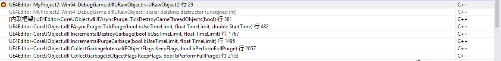

## UE 垃圾回收

UE中采用标记清除（mark-sweep）算法来进行内存回收，回收的对象有：

- UObject或UGCObject的实例
- 在UObject中用宏U_PROPERTY修饰的变量（指针或指针容器）

### UE的簇

说白了就是只有一层子节点的树，子节点仅仅依赖于簇根节点，由于UE中并没有像Qt或FBX SDK中那样指定唯一的父对象，而是指定对象与对象间的依赖关系，所以在创建对象时，会根据对象的依赖关系来创建簇，簇的主要目的是为了当簇根被释放时，能快速定位到所有可进行回收的子对象。

### 回收过程

创建UE工程，编写如下代码，触发UE的垃圾回收：

```C++
UCLASS()
class URawObject : public UObject {
	GENERATED_BODY()
public:
	URawObject() {
		UE_LOG(LogTemp, Warning, TEXT("UObject Construct"));
	}
	~URawObject() {
		UE_LOG(LogTemp, Warning, TEXT("UObject Destruct"));
	}
};

UCLASS()
class MYPROJECT_API AMyActor : public AActor
{
	GENERATED_BODY()
public:	
	AMyActor(){ 
        mUOject = NewObject<URawObject>();
    }

	UPROPERTY(EditAnywhere)
	URawObject* mUOject;
};

```


#### 追踪堆栈



**FAsyncPurge**继承自**FRunnable**

- TickDestroyObjects

  ```c++
  bool FAsyncPurge::TickDestroyObjects(bool bUseTimeLimit, float TimeLimit, double StartTime){
  	while(已销毁对象数量<待销毁总数 ){
  		FUObjectItem* ObjectItem = GUnreachableObjects[ObjCurrentPurgeObjectIndexOnGameThread];			
  		if (ObjectItem){
              ~Object();
              if(bUseTimeLimit&&(FPlatformTime::Seconds() - StartTime) > TimeLimit)
                  break;            // 超时则停止回收
          }
      }
  }
  ```

  > 该阶段直接析构**GUnreachableObjects**`(TArray<FUObjectItem*>)`中的对象，超时会提前结束。

- TickPurge

  ```C++
  void TickPurge(bool bUseTimeLimit, float TimeLimit, double StartTime){
  	bool bCanStartDestroyingGameThreadObjects = true;
  	if (ThreadId != nullptr){	//多线程清理
  		LastUnreachableObjectsCount = GUnreachableObjects.Num();
  		bCanStartDestroyingGameThreadObjects = TickDestroyObjects<false>(bUseTimeLimit, TimeLimit, StartTime);
  	}
  	do{							//在游戏线程中进行清理，如果在其他线程清理完毕，会直接返回。
  		bool ret = TickDestroyGameThreadObjects(bUseTimeLimit, TimeLimit, StartTime); 	
  		if (ThreadId != nullptr && ret){	
  			FinishedPurgeEvent->Trigger();		//执行清理结束的事件
  		}
  	} while (直到清理完成或者超时);
  }
  ```

  > 该阶段用于调度多线程和单线程的清理操作

- IncrementalDestroyGarbage

  ```C++
  bool IncrementalDestroyGarbage(bool bUseTimeLimit, float TimeLimit){
      for(objectItem: GUnreachableObjects){
  		check(objectItem.flags&EInternalObjectFlags::Unreachable);
          if(objectItem.isReadyForFinishDestroy()){
              UObject::ConditionalFinishDestroy(){
                   UObject::DestroyNonNativeProperties()
                   GUObjectArray.RemoveObjectFromDeleteListeners(Object);
              }  
          }
          else{
              GGCObjectsPendingDestruction.Add(Object);
          }
      }
      //step 处理延迟GC的对象(GGCObjectsPendingDestruction中的)，发送FinishDestroy message.
      //step 调用TickPurge进行对象的实际销毁
  }
  ```
  
  > 该阶段

在这里我们已经找到了关键信息，无需继续追踪堆栈调用，可以知道的是：

- UE把所有需要清理的对象放置在`static TArray<FUObjectItem*> GUnreachableObjects`中
- 清理时首先会遍历一遍GUnreachableObjects，如果`Object->isReadyForFinishDestroy`，会发送FinishDestory信号，这里并不会释放对象，而是释放对象的非本地属性，以及剔除所有此对象的监听器，确保这个对象在完成销毁之后，不能通过任何删除监听器(注释映射等)找到它  ，对于没有ready的对象，会将其放置到`static TArray<UObject *> GGCObjectsPendingDestruction;`中，在遍历完所有不可达对象后，再来对其进行处理。
- 清理函数拥有超时参数，再清理完一个对象，发现超时，会直接停止垃圾回收，这些对象会在下次被回收。

#### 追踪不可达对象数组GUnreachableObjects

搜索其引用可以发现它的元素大小只在`void GatherUnreachableObjects(bool bForceSingleThreaded)`函数中发生变动，其中开头有如下实现：

```C++
	const double StartTime = FPlatformTime::Seconds();

	GUnreachableObjects.Reset();	//清空不可达数组
	GUnrechableObjectIndex = 0;

	TArray<FUObjectItem*> ClusterItemsToDestroy;	//簇
	int32 ClusterObjects = 0;

	//将所有的对象均分到多个线程中进行不可达分析
	int32 MaxNumberOfObjects = GUObjectArray.GetObjectArrayNum() - (GExitPurge ? 0 : GUObjectArray.GetFirstGCIndex());
	int32 NumThreads = FMath::Max(1, FTaskGraphInterface::Get().GetNumWorkerThreads());
	int32 NumberOfObjectsPerThread = (MaxNumberOfObjects / NumThreads) + 1;

	// Iterate over all objects. Note that we iterate over the UObjectArray and usually check only internal flags which
	// are part of the array so we don't suffer from cache misses as much as we would if we were to check ObjectFlags.
	ParallelFor(NumThreads, [&ClusterItemsToDestroy, NumberOfObjectsPerThread, NumThreads, MaxNumberOfObjects](int32 ThreadIndex)
	{
		int32 FirstObjectIndex = ThreadIndex * NumberOfObjectsPerThread + (GExitPurge ? 0 : GUObjectArray.GetFirstGCIndex());
		int32 NumObjects = (ThreadIndex < (NumThreads - 1)) ? NumberOfObjectsPerThread : (MaxNumberOfObjects - (NumThreads - 1) * NumberOfObjectsPerThread);
		int32 LastObjectIndex = FMath::Min(GUObjectArray.GetObjectArrayNum() - 1, FirstObjectIndex + NumObjects - 1);
		TArray<FUObjectItem*> ThisThreadUnreachableObjects;
		TArray<FUObjectItem*> ThisThreadClusterItemsToDestroy;

		for (int32 ObjectIndex = FirstObjectIndex; ObjectIndex <= LastObjectIndex; ++ObjectIndex)
		{
			FUObjectItem* ObjectItem = &GUObjectArray.GetObjectItemArrayUnsafe()[ObjectIndex];
			if (ObjectItem->IsUnreachable())		//判断Flags是否包含Unreachable标志
			{
				ThisThreadUnreachableObjects.Add(ObjectItem);
				if (ObjectItem->HasAnyFlags(EInternalObjectFlags::ClusterRoot)) //判断Flags是否包含ClusterRoot标志
				{
					//簇根还拥有一系列的子对象，由于这些子对象可能在ParallelFor的其他线程中处理，那么先把这些簇根记录下来 
					ThisThreadClusterItemsToDestroy.Add(ObjectItem);
				}
			}
		}
		if (ThisThreadUnreachableObjects.Num())	//一次性添加当前线程所有的不可达对象
		{
			FScopeLock UnreachableObjectsLock(&GUnreachableObjectsCritical);
			GUnreachableObjects.Append(ThisThreadUnreachableObjects);
			ClusterItemsToDestroy.Append(ThisThreadClusterItemsToDestroy);
		}
	}, bForceSingleThreaded);
```

```c++
for (FUObjectItem* ClusterRootItem : ClusterItemsToDestroy){
	ClusterRootItem->ClearFlags(EInternalObjectFlags::ClusterRoot);	//清除簇根标志

	const int32 ClusterIndex = ClusterRootItem->GetClusterIndex();	
	FUObjectCluster& Cluster = GUObjectClusters[ClusterIndex];		//根据簇根的index从全局数组GUObjectClusters中获取到簇
    
	for (int32 ClusterObjectIndex : Cluster.Objects){				//遍历簇根，获取子对象的id
		FUObjectItem* ClusterObjectItem = GUObjectArray.IndexToObjectUnsafeForGC(ClusterObjectIndex); //获取到子对象的item
		ClusterObjectItem->SetOwnerIndex(0);						//消除与簇根的引用
    }
	if (!ClusterObjectItem->HasAnyFlags(EInternalObjectFlags::ReachableInCluster)){		//如果不包含簇中可达标记
		ClusterObjectItem->SetFlags(EInternalObjectFlags::Unreachable);					//说明该对象已不可达
		ClusterObjects++;
		GUnreachableObjects.Add(ClusterObjectItem);										//将其添加到GUnreachableObjects中
	}
	GUObjectClusters.FreeCluster(ClusterIndex);											//将簇根从全局的簇根数组中删除
}
```

综上，可以看出GatherUnreachableObjects只是根据对象的标记来添加数组的元素

#### 追踪不可达标记

//PerformReachabilityAnalysis

.......越追越迷，依赖太多，放弃了，大体的结构有点印象。


## 其他框架中的回收机制

### Qt

Qt使用QObject为基类，它的内存回收很简单，就像是下面这样：

```c++
class QObject{
public:
	QObject(QObject * parent = nullptr);
private:
	QVector<QObejct*> children;
	QObject *parent;
}
```

QObject中有一个parent指针，children列表，销毁QObject时会同时销毁children

QObject的还提供一个deleteLater()函数，会将对象添加到一个数组中，在事件处理循环结束之后，才会进行销毁。

### FBX SDK

FBX SDK使用FbxObject为基类，在创建实例时，必须指定其父对象，就像是这样：

```C++
FbxManager* lManager = FbxManager::Create();
FbxIOSettings* lIOSettings = FbxIOSettings::Create(lManager, "");
FbxScene* scene = FbxScene::Create(lManager,"");
FbxSkeleton* skeletonNode = FbxSkeleton::Create(scene,"SkeletonRoot");
FbxCluster* rootCluster = FbxCluster::Create(skeletonNode, "");
```

当父对象释放时，会释放子对象。


上面两个框架的内存回收的主体结构非常简单，对于环路问题，它们会在指定parent时进行检测，出现环路直接给出报错。

## 标记清理算法

标记清理算法的原理

- 将所有可回收对象存储到一个数组中。
- 存储对象间的引用关系。

- 拥有一个全局的根节点，其他节点如果具有到达该节点的引用关系，那么说明该节点是可达的。
- 垃圾回收时，需要挂起游戏线程，保证所有对象不被使用。
- 从根节点遍历，标记所有可达节点。
- 遍历对象数组，将不可达节点进行销毁。

细节可查看：[Mark-and-Sweep：垃圾收集算法](https://www.geeksforgeeks.org/mark-and-sweep-garbage-collection-algorithm/)

### 简易实现

首先定义基类

```C++
class ObjectBase{
public:
	typedef short ID;
public:
	ObjectBase();
	virtual ~ObjectBase();
	void addRefrence(ObjectBase * ref);		//添加对象引用
	void removeRefrence(ObjectBase* ref);	//删除对象引用
private:
	friend class ObjectManagement;
	ID id;						//为该对象分配唯一的id
	std::list<ID> refrence;		//引用对象的id列表
};
```

> 这里使用short是因为它只有两字节，可表示2^15（32767）个数，已经足够用作ID

为了能够管理所有的ObjectBase对象，这里创建了一个全局的管理对象**GObjectManagement**，在构造时将该对象添加到其中，销毁时删除该对象：

```C++
ObjectBase::ObjectBase(){
	GObjectManagement.AddObject(this);
}

ObjectBase::~ObjectBase(){
	GObjectManagement.RemoveObject(this);
}
```

ObjectManagement的定义如下：

```C++
class ObjectManagement {
public:
	ObjectManagement() {
		for (int i = 0; i < mObjects.size(); i++) {		//初始化Id栈
			mObjects[i].object = nullptr;
			mIdStack[i] = i;
		}
	}
	void AddObject(ObjectBase* obj) {		//添加对象
		if (obj != nullptr) {
			obj->id = allocId();
			mObjects[obj->id].object = obj;
			++mCurrentNumberOfObject;
			mMaxIdOfObject = std::max(mMaxIdOfObject, obj->id);
		}
	}
	void RemoveObject(ObjectBase* obj) {	//删除对象
		if (obj != nullptr) {
			mObjects[obj->id].object = nullptr;
			freeId(obj->id);
			--mCurrentNumberOfObject;
		}
	}
	void GarbageCollection() {				//垃圾回收
        
		MarkObjects(0);									//这里假设0号节点是游戏全局的根节点，从它开始遍历，标记可达对象

		for (int i = 0; i <= mMaxIdOfObject; i++) {		//简单遍历所有对象，销毁不可达对象
			if (!mObjects[i].reachable) {
				delete mObjects[i].object;
			}
			else {		//还原状态，为下一此可达性遍历做准备
				mObjects[i].reachable = false;
			}
		}
	}

	void MarkObjects(const ObjectBase::ID& Id) {				//深度遍历所有节点
		ObjectBase* obj = mObjects[Id].object;
		if (obj != nullptr && !mObjects[Id].reachable) {		//要求节点不可达，为了避免出现环路
			mObjects[Id].reachable = true;
			for (auto& subId : obj->refrence) {
				MarkObjects(subId);
			}
		}
	}

private:
	ObjectBase::ID allocId() {					//从栈顶分配Id
		assert(mIdStackTop < mIdStack.size());
		return mIdStack[mIdStackTop++];
	}
    
	void freeId(ObjectBase::ID id) {			//回收Id
		assert(mIdStackTop > 0);
		mIdStack[--mIdStackTop] = id;
	}

public:
	struct ObjectItem{
		ObjectBase* object;
		bool reachable = false;
	};

	static const int MAX_NUMBER_OF_OBJECT = std::numeric_limits<ObjectBase::ID>().max();

	std::array<ObjectItem, MAX_NUMBER_OF_OBJECT> mObjects;		//这里创建了32767大小的定长数组，用于存储所有的Object
    
	std::array<ObjectBase::ID, MAX_NUMBER_OF_OBJECT> mIdStack;	//该定长数组用于模拟栈来分配和回收ID，保证Id不会快速膨胀
	ObjectBase::ID mIdStackTop = 0;								//栈顶索引

	ObjectBase::ID mCurrentNumberOfObject = 0;					//当前存在的Object数量
	ObjectBase::ID mMaxIdOfObject = 0;							//整个程序中所使用过的最大ID，用于减少遍历数
};

//全局静态对象
static ObjectManagement GObjectManagement;
```

下面编写代码进行简单测试：

```C++
class Object : public ObjectBase {
public:
	Object(std::string name):mName(name){
		std::cout << "construct object : " << mName << std::endl;
	}
	virtual ~Object(){
		std::cout << "destruct object : " << mName << std::endl;
	}
private:
	std::string mName;
protected:
};

int main() {
	Object* root = new Object("Root");						//默认把第一个节点当做游戏根节点
	Object* a = new Object("A");
	Object* b = new Object("B");
	Object* c = new Object("C");							
	Object* d = new Object("D");
	Object* e = new Object("E");
	Object* f = new Object("F");

	root->addRefrence(a);									//    root
	root->addRefrence(b);									//    /  \ 
	b->addRefrence(c);										//   A    B
	b->addRefrence(d);										//       / \ 
	c->addRefrence(e);										//      C   D
	c->addRefrence(f);										//     / \ 
	e->addRefrence(f);										//    E - F

	std::cout << "Garbage Collection : 0" <<std::endl;		// 没有对象被回收
	GarbageCollection();
	std::cout << "-----------------------" << std::endl;

	b->removeRefrence(c);									//  去除B对C的引用，C、E、F将会被销毁
	std::cout << "Garbage Collection : 1" << std::endl;
	GarbageCollection();
	std::cout << "-----------------------" << std::endl;
}
```

```scala
construct object : Root
construct object : A
construct object : B
construct object : C
construct object : D
construct object : E
construct object : F
Garbage Collection : 0
-----------------------
Garbage Collection : 1
destruct object : C
destruct object : E
destruct object : F
-----------------------
```

### 过程简述

在创建Object对象时，在构造函数中会将这个对象添加到一个全局的管理器（GObjectManagement）中，开发者可以修改对象间的引用关系，而管理器的垃圾回收，是从游戏唯一的根节点进行深度遍历，从而确定有哪些对象可访问，排除他们，在管理器中其他的对象即使不可达对象。

在UE中，引用关系的改变途径主要有两种：

- 直接修改：UObject底层有直接修改引用关系的API，在上层可能被在Attach，Setup，Add，Remove等这类方法中被调用。
- 间接依赖：这个主要是针对U_PROPERTY，UHT会自动生成对象间的引用关系。

### 标记清理存在的优点

- 它可以处理循环引用的情况。
- 算法执行时不存在额外开销。

### 标记清理存在的缺点

- 执行算法时需要挂起整个程序的运行。

- 执行算法多次后，会产生大量的内存碎片（这一点借助底层的内存分配框架，应该能减少部分负作用）

  

## 一些看法

使用垃圾回收应该主要是为了：

- 降低开发门槛
- 延迟回收
- 解决智能指针环路问题

> 第一条对于我们来说肯定没必要考虑，没必要自找麻烦
>
> 延迟回收作用比较大，构建一个简单的回收队列，就能完成。
>
> 环路问题，要么避免，要么换方案解决


自动垃圾回收的关键：

- 如何组织对象间的引用关系：是使用依赖图，还是关系树？
- 高效的可达性验证：上面的Demo使用了深搜遍历所有对象， 层次变多的话效果会很差，可以像UE那样，在引用关系发生变动时，提前生成簇，这样垃圾回收时就只需要遍历簇群，快速定位可回收对象。
- 安全可靠的回收过程：回收过程中，需要保证所有对象不被使用。


总结：我们可以模仿UE，封装Object，并使用头文件工具自动生成引用关系代码。但关键难点在于：UE中的垃圾回收，写了过万的代码，有非常多的优化细节，这也意味着我们有很多的坑要踩=.=，


## 参考资料

[UE基础—Garbage Collection(垃圾回收)](https://zhuanlan.zhihu.com/p/401956734)

[Mark-and-Sweep：垃圾收集算法](https://www.geeksforgeeks.org/mark-and-sweep-garbage-collection-algorithm/)
