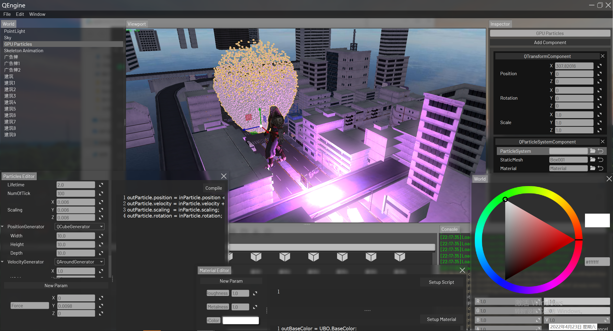
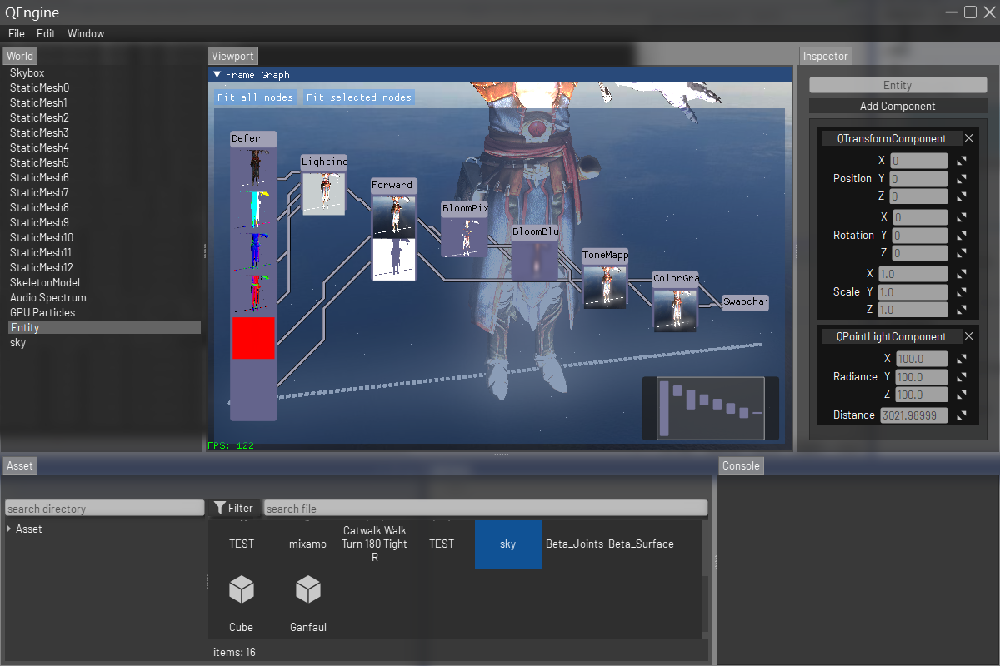

# QEngine

- **心源 Studio**

QEngine是一个简易的开源3D引擎，。

>它的名称是因为开发过程极大程度受益于Qt（反射+RHI+编辑器）

它的设计注重高可读性，且不膨胀的代码。但这也意味着较少的性能优化，所以它主要用于引擎架构及渲染的学习与尝试，以纯教学为目的。

> UP从事于自研引擎方向，对于自身的工作，总是有着很深的无力感。。。
>
> 一方面是因为商业引擎真的做的太好了，可谓是望尘莫及
>
> 另一方面做自研引擎真的是太缺人了（做引擎门槛极高，要求团队里每个人代码素养，架构水平都不低，而国内大部分团队目前主要还是依赖于商业引擎做上层开发，对于引擎的底层及实现等细节的知识体系有很大的断层，导致很多想做引擎的小伙伴只能在门口徘徊，最终投入到商业引擎中的开发中)
>
> > 很多小伙伴可能会问，既然商业引擎都这么好用了，为什么还要搞自研呢？难道自研引擎能做得比UE和Unity还好？对此UP的看法是：
> >
> > - 商业引擎更看重通用性，讲的是十八般武艺，样样精通。自研引擎可以随心所欲地定制，虽然无法像商业引擎那样面面俱到，但在某些方面，比如引擎专属的游戏性，效果啊，可以做的很出彩，可谓是一剑破万法。
> > - 自研引擎未必只是为了游戏，还可以往渲染，音视频，VR，AR方向发展。
>
> 鉴于上面的原因，UP打算打磨出一套完整的引擎基础开发流程，为后面有志于往引擎方向的人，创造一个良好的起点。

> UP的工作经验并不多，大多时间都在闭门造车，走了很多弯路，不过还好总结出一些有价值的东西
>
> 目前这个版本的代码几乎花费了我一年的时间打磨，不断地调整架构，代码从起初的二十多万，优化到现在的仅仅几万，且保证了还不错的可读性，渲染后端也从OpenGL，到Vulkan，再到RHI，这期间UP做了很多的尝试，很多的取舍，纯粹就是靠着头铁熬过来的，但是也存在很多的问题，比如渲染架构做的就很烂，目前的版本是一个对UE渲染体系的拙劣模仿，关于这一点，UP真的很无奈，自己对渲染架构的理解确实不太够，好在大佬开了**Game104**的课程，简直是业界良心，感激不尽T.T，所以UP打算跟随课程把空缺的部分给补上，后续再统一将自己的经验和开发过程总结出来分享给大家，希望大家能少走些弯路，尽快成长，为自研引擎撑出一片天！

## 编辑器

### FrameGraph

## 可执行程序

把**EXE.rar**解压到当前文件夹下，其中Example.exe为不包含编辑器的Demo

## 技术文档

- [QRHI](./Doc/QRHI.md)：Qt6.0推出的RHI接口，支持Vulkan，DX11，OpenGL，Metal，虽然没文档，但是有样例，Vulkan风格的接口，更具可架构性，且使用起来比OpenGL更容易。
- [反射机制](./Doc/反射相关.md)
- [垃圾回收](./Doc/垃圾回收.md)
- [内存管理](./Doc/内存管理.md)
- [Vulkan教程](https://github.com/Italink/HelloVulkan)

## 构建环境

- Qt 6.2.3以上版本：在线下载器[https://download.qt.io/archive/online_installers](https://download.qt.io/archive/online_installers)，安装过程中请勾选
  - Qt 6.2.3+
    - MinGW 64 bit
    - MSVC2019 64-bit 
    - Sources：Qt源码
    - Qt 5 Compatibility Module：Qt6对Qt5的支持
    - Qt Shader Tools：Qt的着色器转换工具源码，用于运行时编译Shader
    - Qt Debug Information Files（MSVC调试Qt源码的PDB文件，比较大，可不勾选）

  - Developer and Designer Tools（一般默认即可）
    - Debugging Tools for Windows
    - CMake
    - Ninjia

- Vulkan SDK
- MSVC 2019 

## 涵盖知识点

- 反射：moc 原理及扩展。
  - 基于宏标记的Lua API绑定
  - 基于反射的自动序列化。
- 渲染架构 ——ECS（实体-组件-系统）
  - 可编程性：QEngine中使用了模块化Shader的做法，这一想法主要体现在材质和GPU粒子上，QEngine将材质定义为：一部分的Uniform和Shader。因此用户可以对这部分内容进行编辑。内部在渲染一个物体时，会根据材质等各类属性，完成渲染管线中Shader的拼接和UBO的管理。

  - 组件
    - 渲染组件
      - 静态网格体
        - 2D网格文字

      - 骨骼网格体
      - 天空盒
      - GPU粒子系统
      - 频谱

    - 光源组件
      - 平行光
      - 点光源

  - FrameGraph
    - RenderPass：支持前向、延迟渲染
    - ImGUI：程序内UI
    - DebugDraw：边缘检测，鼠标点选
    - 后期滤镜
      - Blur：高斯模糊
      - Bloom：辉光
      - HDR
      - ColorGrading：使用LUT调色

- 音频
  - Windows 声卡实时采集：使用WAS API 实时采集扬声器输出。
  - 频谱分析、可视化：使用FFTW做频谱分析。
- 资产管理：通过Assimp从外部导入，内部通过特定的编辑器对其处理，存储上核心的点是：基于Qt MetaSystem的对象序列化。
  - 静态网格
  - 骨骼
  - 动画
  - 材质
  - 粒子系统

- 编辑器
  - 样式管理：支持整体上的QSS，支持Icon运行时变色
  - Dock窗口及布局管理
  - 大量自定义控件
  - 组件
    - 高性能的资产面板：多线程搜索、大数量文件Icon缓存
    - 基于反射自动生成Property面板
    - 场景编辑
  - Lua IDE：场景脚本
  - GLSL IDE： 动态材质、GPU粒子
  - 撤销、重做管理

